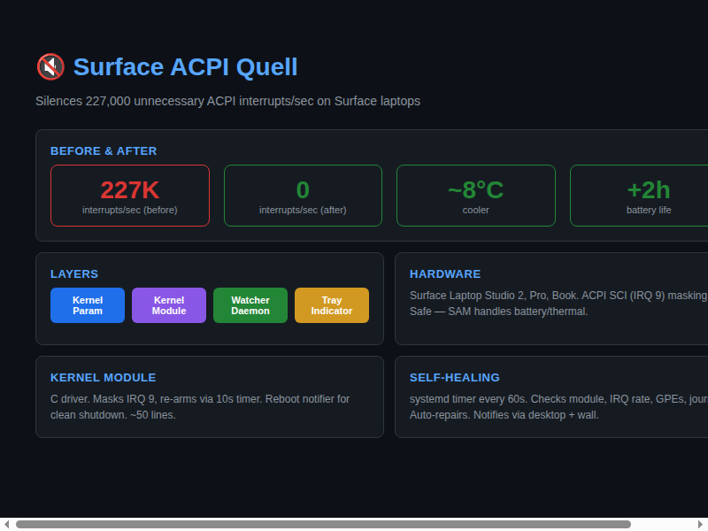

# Surface ACPI Quell



[](https://github.com/aaaronmiller/surface-fixed-event-quell)
[](MIT)
[](https://en.wikipedia.org/wiki/C_(programming_language))

**Silence the ACPI interrupt storm on Microsoft Surface laptops running Linux.**

Surface firmware emits **~227,000 unnecessary ACPI interrupts per second** — GPEs and fixed events that the Linux kernel can't handle because Microsoft's ACPI tables lack the expected implementations. This floods the CPU, spins up fans, burns NVMe writes with error logs, and drains battery.

**Surface ACPI Quell** kills the storm at three layers:

| Layer | Method | Effect |
|-------|--------|--------|
| 1 | Kernel parameter `acpi_mask_gpe` | Blocks problem GPEs (0x68–0x6F) before the kernel even sees them |
| 2 | Kernel module `surface_fixed_event_quell` | Masks the ACPI SCI (IRQ 9) — safe because Surface hardware uses its own Aggregator Module for battery/thermal/fan |
| 3 | Watcher daemon | systemd timer every 60s that checks integrity, auto-repairs, and notifies you |
| 4 | Rogue watcher (`rogue-watcher.sh`) | Snapshot-comparison daemon that detects stuck/orphaned processes (e.g. a codex CLI writing SQLite for 4 days) |
| 5 | Tray indicator (`indicator.py`) | System tray icon showing ACPI + rogue status with right-click actions |

**Result:** Zero ACPI errors. Zero unnecessary interrupts. Cool and quiet.

---

## Quick Start

```bash
# Clone and build
cd surface-acpi-quell
make
sudo make install
```

```bash
# Add the kernel parameter for GPE mask (one-time, survives kernel updates)
# Edit /etc/kernel/cmdline and add:
#   acpi_mask_gpe=0-3,7-22,104-111
# Then run:
sudo kernel-install -v add $(uname -r) /lib/modules/$(uname -r)/vmlinuz
```

```bash
# Reboot
sudo systemctl reboot
```

After reboot, verify:

```bash
cat /proc/interrupts | grep acpi   # IRQ 9 should be stable (not rising)
lsmod | grep surface_fixed          # module should be loaded
journalctl -k -n 10 | grep -c "ACPI Error"  # should be 0
```

---

## Components

### 1. Kernel Module (`surface_fixed_event_quell.ko`)

Masks the ACPI SCI interrupt (IRQ 9 by default, configurable via `irq_number` parameter). A re-arm timer fires every 10 seconds to catch firmware re-enables.

```bash
# Load manually
sudo modprobe surface_fixed_event_quell

# With custom IRQ
sudo insmod surface_fixed_event_quell.ko irq_number=9

# Check status
lsmod | grep surface_fixed_event_quell
```

### 2. Watcher Daemon (`surface-acpi-watcher`)

A bash script triggered by a systemd timer every 60 seconds. Checks:

- **Module loaded?** If missing, tries to load/reload/rebuild.
- **IRQ 9 stable?** If rising >500/sec, reloads the module to re-mask.
- **GPEs disabled?** Refreshes GPE 0x68–0x6F disable (idempotent).
- **Journal clean?** If ACPI errors still appear, notifies user.

Notifications via `wall`, `notify-send`, and syslog.

### 3. Rogue Watcher (`rogue-watcher`)

A snapshot-comparison daemon that detects stuck or orphaned processes —
like a codex CLI that runs for 4.5 days writing 6 MB/s to SQLite with
no one watching.

**How it works:**

1. Every 30 seconds, snapshots all processes via `ps` (fast, ~0.5s)
2. For each process, computes a **fingerprint**: state + RSS quantised +
   CPU% quantised + disk writes quantised
3. If a process shows the same fingerprint across 10+ consecutive cycles
   (>5 min), AND has **no controlling TTY** (i.e., not an interactive
   session like pi/editor), AND its **PPID is 1 or its parent is dead**
   (orphan signal): desktop notification + journal log
4. Writes status to `/tmp/rogue-watcher.json` for the tray indicator to
   display

**Heuristics:**

- Processes with a TTY (`pts/*`, `tty*`) are **never flagged** — they're
  interactive user sessions
- PPID = 1 (init/adopted) + no TTY = orphaned
- Kernel threads (no `/proc/[pid]/exe`) detected but not alerted
- Configurable: `--interval`, `--cycles`, `--min-age`, `--dry-run`

```bash
# Run in foreground (for testing)
./rogue-watcher.sh --foreground --min-age 5 --cycles 3 --dry-run

# Install systemd user service
cp rogue-watcher.service ~/.config/systemd/user/
systemctl --user daemon-reload
systemctl --user enable --now rogue-watcher.service
```

### 4. Tray Indicator (`surface-acpi-indicator`)

A Python/GTK system tray icon that shows status at a glance and provides quick actions via right-click menu.

| Icon | Meaning |
|------|---------|
| Green | ✅ ACPI storm suppressed |
| Yellow | ⚠️ Degraded — investigate |
| Red | 🚨 Fix failed — active storm |
| Gray | ❓ Status unknown |

Right-click menu: Check Now, Run Fix, Rebuild Module, View Log, Documentation.

Works on all Wayland desktops via XDG StatusNotifierItem (AppIndicator3):
- **GNOME:** needs `gnome-shell-extension-appindicator`
- **KDE Plasma:** native support
- **Hyprland:** waybar tray or any SNI panel
- **Sway, XFCE, Cinnamon:** all supported

---

## After a Kernel Update

The GPE mask in the kernel parameter survives kernel updates (it's stored in
`/etc/kernel/cmdline`). The kernel module must be rebuilt for the new kernel:

```bash
cd /path/to/surface-acpi-quell
make clean && make
sudo make install
sudo dracut --force --add-drivers surface_fixed_event_quell
sudo systemctl reboot
```

The watcher will alert you if you forget — but the machine will heat up until
you rebuild.

---

---

## Agentic Deployment

> Copy the block below and give it to any AI coding agent to deploy this project
> from scratch. It contains all commands, paths, dependencies, and verification
> steps in dependency order — no additional context needed.

````markdown
# Agentic Deployment: surface-acpi-quell

## Context
ACPI interrupt storm fix for Surface laptops. Symptoms:
- High CPU iowait, fans spinning, NVMe writes from error logs
- IRQ 9 rising at ~227K/sec in /proc/interrupts
- Journal flooded with "ACPI Error: No handler for GPE"

## Dependencies
- `gcc`, `make`, `kernel-devel` (for kernel module)
- `python3-gi`, `python3-appindicator3` (optional, for tray icon)
- Systemd (for watcher timer and rogue-watcher service)

## Install & Setup

```bash
cd /path/to/surface-acpi-quell

# 1. Build and install kernel module
make clean && make
sudo make install
sudo depmod -a
sudo dracut --force --add-drivers surface_fixed_event_quell
sudo modprobe surface_fixed_event_quell

# 2. Add kernel GPE mask parameter
echo 'GRUB_CMDLINE_LINUX="$GRUB_CMDLINE_LINUX acpi_mask_gpe=0-3,7-22,104-111"' | sudo tee -a /etc/default/grub
sudo kernel-install -v add $(uname -r) /lib/modules/$(uname -r)/vmlinuz

# 3. Install watcher (systemd timer, runs every 60s)
sudo cp surface-acpi-watcher.service surface-acpi-watcher.timer /etc/systemd/system/
sudo cp watcher.sh /usr/local/bin/surface-acpi-watcher.sh
sudo systemctl enable --now surface-acpi-watcher.timer

# 4. Install rogue-watcher (systemd user service, auto-detect orphaned processes)
mkdir -p ~/.config/systemd/user/
cp rogue-watcher.service ~/.config/systemd/user/
systemctl --user daemon-reload
systemctl --user enable --now rogue-watcher.service

# 5. Install tray indicator (optional, shows ACPI + rogue status)
sudo cp indicator.py /usr/local/bin/surface-acpi-indicator.py
# Autostart:
mkdir -p ~/.config/autostart
cat > ~/.config/autostart/surface-acpi-indicator.desktop << 'EOF'
[Desktop Entry]
Type=Application
Name=Surface ACPI Fix Indicator
Exec=/usr/local/bin/surface-acpi-indicator.py
Terminal=false
Categories=Utility;
X-GNOME-Autostart-enabled=true
EOF
# Start now:
DISPLAY=:0 nohup /usr/local/bin/surface-acpi-indicator.py &
```

## Verify

```bash
lsmod | grep surface_fixed_event_quell   # should show loaded
grep acpi /proc/interrupts                # IRQ 9 should be stable
journalctl -k -n 10 | grep -c "ACPI Error" # should be 0
systemctl is-active surface-acpi-watcher.timer  # should be active
systemctl --user is-active rogue-watcher.service # should be active
cat /tmp/rogue-watcher.json              # should exist, valid JSON
```

## Troubleshooting

- **Module not loaded after kernel update:** Rebuild with `make clean && make && sudo make install && sudo dracut --force --add-drivers surface_fixed_event_quell`
- **Tray icon not showing:** `acpi-indicator-restart` alias, or Alt+F2 → r → Enter to restart GNOME Shell
- **Rogue watcher not running:** Check `systemctl --user status rogue-watcher.service`
````

---

## Uninstall

```bash
sudo make uninstall
```

Then remove the `acpi_mask_gpe=0-3,7-22,104-111` parameter from
`/etc/default/grub` and `/etc/kernel/cmdline`, and reboot.

---

## Compatibility

Tested on:

| Device | Kernel | Status |
|--------|--------|--------|
| Surface Laptop Studio 2 | 6.19.8-surface.fc43 | ✅ Confirmed |
| Surface Pro (expected) | surface kernel | ✅ Should work |
| Surface Book (expected) | surface kernel | ✅ Should work |

The IRQ 9 mask is safe on any Surface device because the Surface Aggregator
Module (SAM) — not ACPI — handles battery, thermal, fan, and platform
monitoring.

**Non-Surface devices:** Do not use the IRQ 9 mask. Standard ACPI interrupts
are required for power management on non-Surface hardware. The GPE mask may
still be useful if you have a similar firmware bug — adjust the GPE numbers
in the kernel parameter to match your hardware's flood.

---

## License

MIT. See [LICENSE](LICENSE).

## Author

Barnacle O'Byte — a surly Irish pirate who'd rather code than plunder.

---

## Roadmap

See [ROADMAP.md](ROADMAP.md) for planned features, phases, and halo goals:

- **Phase 1** ✅ Foundation complete
- **Phase 2** 🔜 Config file, auto-detect GPEs, non-Surface safety
- **Phase 3** 📦 Distribution packages (COPR, AUR, PPA)
- **Phase 4** 🌐 Cross-desktop (KDE, Hyprland) and cross-model (Surface Pro, Book)
- **Phase 5** 🤖 Self-tuning and predictive alerts
- **Phase 6** 🌟 Upstream kernel integration
